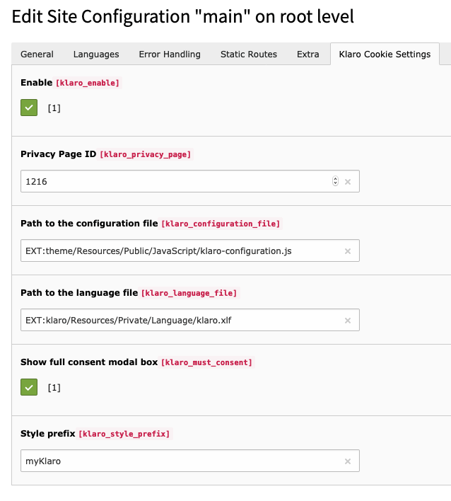

# TYPO3 Extension `klaro`

This is another cookie consent solution using [klaro](https://klaro.kiprotect.com/).

Translations for the following languages are included: de, el, es, fr, hr, hu, it, nl, pl, ro, sk, sl, sr.

## Usage

**1. Install extension**

Use either composer `composer require studiomitte/klaro` or install the extension via Extension Manager.

**2. Setup configuration in sites module**

Switch to the sites module and configure the extension. All configurations are described below.

**3. Adopt configuration to your needs**

Copy one of the JavaScript files in `EXT:klaro/Resources/Public/Example/` to your theme extension (or fileadmin), adopt it to your needs and define the path to the file in the site configuration.

## Configuration

### Site Configuration

The sites module is used for the main configuration.



The following options are available:

- `Enable`: Enable the klaro cookie consent management
- `Privacy Page ID`: Define the uid of the page with the privacy information
- `Path to the configuration file`: Define the path to the JavaScript file containing the klaro configuration
- `Path to the language file`: Use custom xlf files for localization.
- `Show full consent modal`: If set, the consent modal is shown when the page is rendered, instead of a small modal in the bottom of the page.
- `Path to the core Klaro JS file`: Use alternative version of klaro.
- `Style prefix`: Use a custom CSS.

### Klaro configuration

Klaro is using a JSON file for its configuration. An example:

```js
var klaroConfig = {
    cookieExpiresAfterDays: 365,
    default: true,
    mustConsent: false,

    apps: [
        {
            name: 'googleTagManager',
            title: 'Google Tag Manager',
            purposes: ['analytics'],
            required: true
        },
        {
            name: 'googleAnalytics',
            title: 'Google Analytics',
            purposes: ['analytics'],
            cookies: [/^ga/i],
            callback: function (consent, app) {
                if (consent !== false) {
                    window.dataLayer = window.dataLayer || [];
                    window.dataLayer.push({'event': 'loadgtm-analytics'})
                }
            },
        }
    ],
};
if (typeof klaroConfigTranslations !== 'undefined') {
    for (var attr in klaroConfigTranslations) {
        klaroConfig[attr] = klaroConfigTranslations[attr];
    }
}
```

This example will load show 2 apps, **Google Tag Manager** which is always loaded and **Google Analytics**.
The latter will be loaded by GTM and the callback must be used to actually load it only if the consent is given by the user.

See https://klaro.kiprotect.com/#getting-started for all configuration options

### Inline code

To load inline code only after consent, use an example like below:

```html
    <script type="opt-in" data-type="application/javascript" data-name="googleAnalytics">(function(w,d,s,l,i){w[l]=w[l]||[];w[l].push({'gtm.start':
    new Date().getTime(),event:'gtm.js'});var f=d.getElementsByTagName(s)[0],
    j=d.createElement(s),dl=l!='dataLayer'?'&l='+l:'';j.async=true;j.src=
    'https://www.googletagmanager.com/gtm.js?id='+i+dl;f.parentNode.insertBefore(j,f);
    })(window,document,'script','dataLayer','123456');</script>
```

The `src` attribute is changed to `data-src` and the attribute `data-name="googleAnalytics"` which correlates with the name of the app above.
The JavaScript is then only evaluated if the consent is given.

### Privacy Page

It is required that users can change their consent. This is possible by linking to the following pseudo urls.

Use the following pseudo-links

- Open the consent modal: `https://KLARO_CONSENT.com`
- Reset consent: `https://KLARO_RESET.com`

The urls will be replaced dynamically by a JavaScript link which will then trigger the consent modal.

### Styling

If the configuration `Style prefix` is set, it is used as a prefix and you can apply your own CSS rules.
The SCSS files in `EXT:klaro/Resources/Private/Scss/` should be copied to your frontend pipeline and modified to your needs.


## Credits

This extension was created by Georg Ringer for [Studio Mitte, Linz](https://studiomitte.com) with ♥.

[Find more TYPO3 extensions we have developed](https://www.studiomitte.com/loesungen/typo3) that provide additional features for TYPO3 sites. 

